# Title

Aspio · SE1 → SE2 · Phase 1

# Marketplace Web + App

Phase 1 proposals for both surfaces — same rhythm, separate trust boundaries.

Proposal only · Implementation after written acceptance

---

# Agenda

Part A — Marketplace Web

| # | Challenge | Risk if we do nothing |
|---|-----------|------------------------|
| **W1** | **Ship without proof** — no CI quality gates before Vercel | Type errors and broken booking paths can reach customers |
| **W2** | **Trusted booking gateway** — APIs trust the browser too much | Arbitrary hosts, weak identity, hard-to-trust booking boundary |
| **W3** | **Authoritative analytics** — clients can forge metrics | Fake clicks/views, PII on company docs |

Part B — Marketplace App

| # | Challenge | Risk if we do nothing |
|---|-----------|------------------------|
| **A1** | **Trusted engagement events** — client writes analytics | Forgeable views/clicks + email on company docs |
| **A2** | **Release confidence pipeline** — no store release gate | Broken builds reach TestFlight / Play internal |
| **A3** | **Scalable booking deep links** — full companies scan | Cost, latency, wrong-company / offline confusion |

Rhythm each time: <strong>Problem → Evidence → Architecture → Solution → Plan</strong>

---
layout: with-outline-center
---

Context

# Marketplace surfaces

Aspio customer marketplace — Web first in this deck, then the Flutter App.

- **Web:** Next.js 16 / React 19 · Vercel · Firebase · Nest / Cloud Functions
- **App:** Flutter Marketplace · Firebase · Sentry / App Check / Shorebird
- Shared concerns: booking trust, engagement integrity, release confidence
- Evidence: web repo + Vercel; app challenges from the mobile proposal packs

---

# What Phase 1 is

The gate before we write production code

Phase 1 is the <strong>proposal</strong>. The panel must accept the scope in writing before Phase 2 implementation starts.

- I present the problem, architecture, tradeoffs, and a testable plan
- Panel outcome: **Accepted** / **Accepted with changes** / Not accepted
- If accepted with changes, <strong>those changes become the scope</strong>
- I implement in Phase 2 **only after** that written acceptance

**Ask at the end:** assign one challenge → accept this proposal as Phase 2 scope.

---
layout: with-outline-section
---

# Challenge 1

## Ship without proof

Marketplace can deploy to Vercel without proving lint, types, tests, booking smoke, or basic performance.

Brief name: <strong>Release confidence for Marketplace</strong>

---
layout: with-outline-two-cols
---

# C1 · Problem

Full problem

The repo only enforces <strong>branch policy</strong>. There is no required typecheck or test suite in CI. Next.js is set to <strong>ignore TypeScript build errors</strong>. Booking unit tests exist but nothing runs them. Vercel only runs <strong>next build</strong>, with <strong>no Deployment Checks</strong>.

Short version: we check the git path, not that the product still works.

::right::

Business impact

- Type or booking bugs can reach **Production customers**
- Discovery → booking funnel breaks hurt conversion
- Failures show up late — on Vercel or in prod, not in the PR
- Branch policy feels “safe” while quality is still ungated

---

# C1 · Evidence

What the repo and Vercel show

- No quality CI — only branch-policy workflows
- No typecheck / test scripts — `package.json` has build + lint only
- `ignoreBuildErrors: true` — TypeScript debt can still ship
- ~23 booking-related tests — no runner, no CI gate
- Vercel = `next build` only — Deployment Checks: **none**
- Preview URL exists — still **ungated** for quality signals

---
layout: with-outline-center
---

# C1 · Architecture

Proposed quality pipeline

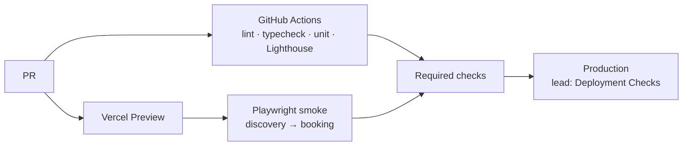

CI owns quality · Vercel hosts · browser untrusted · Firebase/Nest unchanged

---
layout: with-outline-two-cols
---

# C1 · Solution

What we accept from the challenge

This is the Phase 2 scope I am proposing

- Add a **GitHub Actions** quality workflow: lint, typecheck, unit tests
- Add **Playwright** smoke: public discovery → booking entry on Preview
- **Document** how checks gate merge and Production (lead applies settings)
- **Staged plan** to remove `ignoreBuildErrors` safely
- Add a **Lighthouse** budget on one public route
- Document **env boundaries**: local / Preview / Production — no secrets in `NEXT_PUBLIC_*`

::right::

# Rejected

What we will not do — and why

**Rejected alternative:** only turn off `ignoreBuildErrors` and hope Vercel build is enough.

- **Why reject:** ~255 TS errors today — flipping the flag alone can break Production builds
- **Why reject:** still no unit tests, Playwright, or Lighthouse gate
- **Why reject:** booking tests stay unrunnable — the brief’s main risk stays open
- **Chosen instead:** full quality pipeline + staged TypeScript cleanup

---

# C1 · Plan

How I will deliver Phase 2 · 3–5 working days

Speak-through plan — each day maps to the accepted solution above.

- **Day 1 — Foundation:** Add reproducible `typecheck` and `test` scripts. Make lint reliable in CI. Land `.github/workflows/quality.yml` so every PR runs lint, typecheck, and the selected unit suite the same way locally and in GitHub Actions.
- **Day 2 — TypeScript migration plan:** Capture the current error baseline while `ignoreBuildErrors` stays true on Vercel. Write a short staged plan (inventory → CI gate → remove ignore flag) so we do not break Production with a big-bang flip.
- **Day 3 — Playwright smoke:** Add a small E2E path: public discovery → booking entry against a Vercel Preview URL (or documented equivalent). No production credentials. Wire it as a CI check the lead can require.
- **Day 4 — Performance + gates runbook:** Add Lighthouse CI (or equivalent) for one public route with a justified budget. Document env boundaries (local / Preview / Production) and the exact GitHub + Vercel Deployment Checks a lead should turn on — we do not change branch protection ourselves.
- **Day 5 — Harden + demo:** Fix flakes, finish the runbook (setup, verify, rollout, rollback), open the PR, and dry-run the 15–20 minute demo: green quality checks, Preview smoke, and the lead checklist.

<strong>Demo promise:</strong> Show a PR where quality checks run; show Playwright against Preview; show the written plan for removing ignored TS errors and for the lead to apply required status checks.

---
layout: with-outline-section
---

# Challenge 2

## Trusted booking gateway

Booking APIs currently trust the browser for destination, credentials, and identity — so authorization and failure behavior are hard to reason about.

Brief name: <strong>Trusted booking gateway</strong>

---
layout: with-outline-two-cols
---

# C2 · Problem

Full problem

<code>app/api/booking-proxy</code> accepts a caller-provided <strong>url</strong>, <strong>token</strong>, <strong>HTTP method</strong>, and <strong>body</strong>, then the server fetches that URL. Separate booking <strong>get</strong> and <strong>update</strong> routes forward <code>uid: undefined</code> to Cloud Functions. The availability route lets a caller set <code>useNestBackend</code> and forwards body fields to Nest. These boundaries make source-of-truth authorization, destination control, and failure behavior difficult to reason about.

Short version: the browser helps decide <strong>where</strong>, <strong>with which token</strong>, and <strong>as whom</strong>.

::right::

Business impact

- Open proxy / SSRF-style risk via arbitrary `url` + token
- Weak booking identity — Cloud Functions get `uid: undefined`
- Availability backend can be steered by the client
- Downstream errors/stacks can leak to the browser
- Hard for support and security to trust the booking boundary

---

# C2 · Evidence

What the Marketplace web routes show

| Route | Issue |
|-------|--------|
| `/api/booking-proxy` | Caller supplies `url` + `token` + method + body → server `fetch` |
| `/api/bookings/get` · `update` · `delete` | Forwards `uid: undefined` to Cloud Functions |
| `/api/get-availability` | Caller can set `useNestBackend` and forward Nest fields |

**Good pattern already in repo:** `validate-discount` — verify Firebase ID token, derive `uid` server-side, return a stable error shape with `traceId`.

**Delete residual:** hard-delete UI may be off, but `/api/bookings/delete` still exists and is callable. UI off ≠ API safe → disable the route or put it behind the same gateway rules (future-ready).

---
layout: with-outline-center
---

# C2 · Architecture

Today vs proposed trust boundary

<strong>Row 1 — Today (browser-owned)</strong>

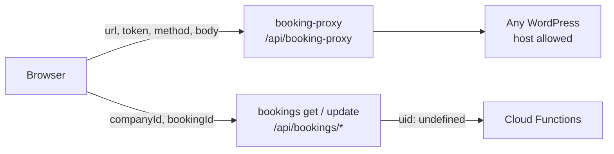

<strong>Row 2 — Proposed (server-owned)</strong>

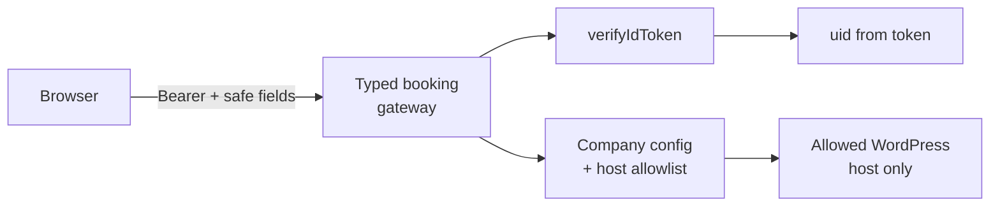

Browser untrusted · Next.js owns destination + credentials + identity · Nest/CF contracts stated at the Marketplace boundary

---
layout: with-outline-two-cols
---

# C2 · Solution

What we accept from the challenge

This is the Phase 2 scope I am proposing — one coherent booking slice

- Replace the WordPress booking **update** path (today via booking-proxy) with a **typed server-owned gateway**
- Derive destination + credentials from **server-owned company config / allowlist** — never from the browser request
- **Verify Firebase ID tokens** where the customer must be signed in; derive `uid` server-side only
- Keep a **stable, safe client error contract** and propagate a **correlation ID** to logs and downstream calls
- Keep availability **intentionally public**, but with **input schema validation** and explicit **rate / abuse controls**; stop trusting client `useNestBackend`
- Handle **delete residual**: disable the open delete route **or** apply the same gateway rules if product may re-enable it later

::right::

# Rejected

What we will not do — and why

**Rejected alternative:** add auth middleware to booking-proxy but still accept caller-provided `url` + `token`.

- **Why reject:** an authenticated open proxy is still an open proxy
- **Why reject:** destination and WordPress credentials must be server-owned, not client-supplied
- **Why reject:** fixing only UI checks does not stop direct API abuse
- **Chosen instead:** one typed gateway slice + validate-discount patterns (auth, traceId, safe errors)

---

# C2 · Plan

How I will deliver Phase 2 · 3–5 working days

Speak-through plan — each day maps to the accepted solution above. Work stays in the Marketplace web repo unless the panel grants Nest/CF access.

- **Day 1 — Helpers + design lock:** Confirm the update-gateway slice. Add shared helpers: Bearer ID-token verify, server-derived `uid`, correlation ID, safe error shape, and host allowlist. Spike where company WordPress base URL + token live in Firestore today.
- **Day 2 — Typed gateway:** Implement the server-owned update route. Point the existing client caller (`lib/api/bookings.ts` path) at the new gateway. Feature-flag the old proxy path for safe rollback.
- **Day 3 — Availability + delete residual:** Stop trusting client `useNestBackend` (read company flag server-side). Add schema validation + basic rate/abuse controls on availability. Disable or secure `/api/bookings/delete` with the same rules.
- **Day 4 — Route tests:** Positive and negative tests with mocked Firebase Admin and mocked downstream HTTP — happy path, missing/invalid token, cross-user, arbitrary host rejected, timeout, downstream 5xx. No secrets in fixtures.
- **Day 5 — Runbook + demo:** Write design summary, verify steps, rollout/rollback, and downstream contracts. Open the PR, call out any scope deltas, dry-run the 15–20 minute walkthrough.

<strong>Demo promise:</strong> Show the old proxy risk (arbitrary host rejected by the new gateway); show invalid token and cross-user failures; show a happy path with mocked WordPress/CF; show availability still works without client Nest override; show delete disabled or secured.

---
layout: with-outline-section
---

# Challenge 3

## Authoritative analytics

Anyone can write marketplace analytics into company documents — so clicks and views are not trustworthy metrics.

Brief name: <strong>Authoritative marketplace analytics</strong>

---
layout: with-outline-two-cols
---

# C3 · Problem

Full problem

Firestore rules permit anyone to update company <code>call_clicks</code>, <code>booking_clicks</code>, <code>website_view</code>, and <code>ad_analytics</code>. Client helpers append <strong>email</strong>, <strong>client timestamps</strong>, and <strong>source</strong> values directly to company-document arrays. A browser can forge or replay this data, PII is retained in operational documents, and document growth has no visible retention boundary. The repository already uses callable functions for ad events, so there is a real alternative pattern to evaluate.

Short version: we treat analytics as if the browser were honest — it is not.

::right::

Business impact

- Forged or replayed clicks and website views
- PII (email) stored on operational company docs
- Unbounded array growth → cost and slower catalogue reads
- Untrusted metrics → bad marketing / ranking decisions
- Inconsistent patterns: ads use callables; views/clicks use open rules

---

# C3 · Evidence

What the repo and rules show

| Area | Evidence |
|------|----------|
| Firestore rules | Public `update` if only tracking keys change |
| Client helpers | `trackCallClick` / `trackBookingClick` → `arrayUnion` with email + timestamp + source |
| Website views | Client `trackWebsiteView` writes `website_view` arrays |
| Better pattern | `AdBanner` → callables `logAdImpression` / `logAdClick` |

**Good pattern already:** ad events use `{ adId, companyId, placement }` via Cloud Functions — no client `arrayUnion` for ads. Views and conversion clicks should follow that model.

**Assessment constraint:** do not migrate or delete production analytics. Design for coexistence / dual-read with legacy arrays.

---
layout: with-outline-center
---

# C3 · Architecture

Today vs proposed trust boundary

<strong>Row 1 — Today (client-authoritative)</strong>

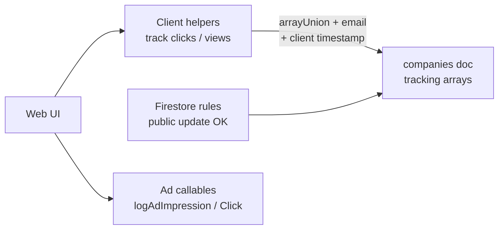

<strong>Row 2 — Proposed (server-authoritative)</strong>

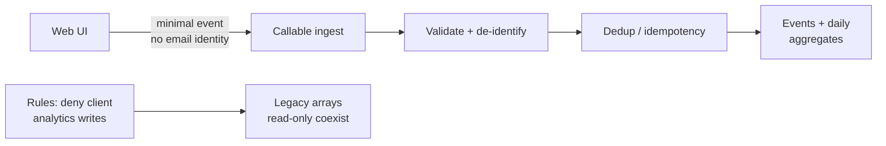

DoD slice: website views + one conversion · catalogue public reads stay · no production analytics delete

---
layout: with-outline-two-cols
---

# C3 · Solution

What we accept from the challenge

This is the Phase 2 scope I am proposing

- Design a **server-authoritative ingest** path for **website views** + **one conversion** (booking click or call click)
- **Validate** event shape; **reject or de-identify** browser-supplied identities (no email as authority)
- Use a **scalable event model** with aggregation + retention; support reporting via aggregates
- **Tighten Firestore rules** so selected analytics fields cannot be mutated by arbitrary clients
- Keep **public catalogue reads** working
- Prefer extending the existing **ad callable** pattern (`logAdImpression` / `logAdClick`)
- **Coexistence only** — no production analytics migrate/delete in this assessment

::right::

# Rejected

What we will not do — and why

**Rejected alternative:** only require auth in rules, but keep client `arrayUnion` into company arrays.

- **Why reject:** signed-in users can still forge volume and replay events
- **Why reject:** PII and unbounded document growth remain
- **Why reject:** big-bang prod array migration is out of scope and unsafe here
- **Chosen instead:** callable ingest + locked rules + aggregates beside legacy arrays

---

# C3 · Plan

How I will deliver Phase 2 · 3–5 working days

Speak-through plan — each day maps to the accepted solution above.

- **Day 1 — Consumers + schema lock:** Confirm with the panel which reporting consumers read legacy arrays, and which conversion to implement (booking click vs call click). Lock event schema, aggregate layout, retention, and callable vs Next Admin path (prefer callable to mirror ads).
- **Day 2 — Ingest + client switch:** Implement server ingest for website_view + one conversion. Replace client helpers so they no longer `arrayUnion` those fields; send minimal events with server timestamps and dedup keys.
- **Day 3 — Rules + coexistence:** Tighten Firestore rules so selected analytics fields are not client-writable. Keep company/catalogue public reads. Document dual-read coexistence for legacy arrays — no prod wipe.
- **Day 4 — Tests + observability:** Emulator/security tests (client update denied). Unit tests for validation, dedup, aggregation, replay, and invalid events. Log/metrics for rejects and downstream failures.
- **Day 5 — Runbook + demo:** Write rollout/rollback/coexistence notes, open the PR, dry-run the 15–20 minute demo: forge path blocked, happy ingest, catalogue still readable.

<strong>Demo promise:</strong> Show rules rejecting a direct client write to tracking fields; show valid website_view + conversion accepted once; show replay rejected; show public catalogue read still works; show coexistence decision (no prod delete).

<strong>Ask panel:</strong> preferred conversion · reporting consumers · non-prod Firebase / emulator · CF deploy access if needed

---
layout: with-outline-section
---

# Marketplace App

## Phase 1 challenges

Flutter Marketplace — engagement trust, release confidence, and scalable booking deep links.

Same Phase 1 gate: proposal only until Accepted / Accepted with Changes.

---
layout: with-outline-section
---

# App C1

## Trusted engagement events

Organic marketplace engagement is written from the Flutter client into company documents — unlike ad analytics, which already use trusted callables.

---
layout: with-outline-two-cols
---

# A1 · Problem

Full problem

Marketplace engagement is written from the Flutter client directly into company documents: <code>website_view</code>, <code>call_clicks</code>, and <code>booking_clicks</code> via <code>FieldValue.arrayUnion</code>. Payloads include <strong>email</strong>, client <strong>date</strong>, and <strong>source</strong>. Website-view cooldown is client-only <code>SharedPreferences</code> (bypassable). Call/booking clicks have no server dedupe. Ad analytics already use callables <code>logAdImpression</code> / <code>logAdClick</code> with <code>{ adId, companyId, placement }</code> and <strong>no email</strong>.

::right::

Business impact

- Companies see inflated / forged views and clicks
- Aspio cannot trust metrics for ranking or abuse review
- Customer email retained on company documents
- Modified clients can mutate analytics if rules allow
- Unbounded arrays grow cost and document size

---

# A1 · Evidence

Verified call sites + payload

| Event | Field | Mechanism |
|-------|--------|-----------|
| Website view | `website_view` | `arrayUnion` |
| Call click | `call_clicks` | `arrayUnion` |
| Booking click | `booking_clicks` | `arrayUnion` |

- `service_popup_card.dart` — `_trackWebsiteView` / `_trackCallClick` / `_trackBookingClick`
- `marketplace_page.dart` — same three methods on `_CompanyCardState`
- Payload today: `{ email, date, source: 'Mobile Marketplace' }`
- Ads contrast: `httpsCallable` · no email · server write

---
layout: with-outline-center
---

# A1 · Architecture

Today vs proposed trust boundary

<strong>Row 1 — Today (device writes company arrays)</strong>

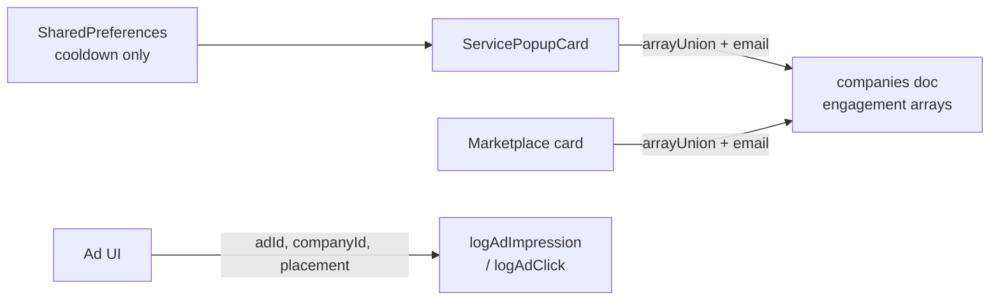

<strong>Row 2 — Proposed (callable like ads)</strong>

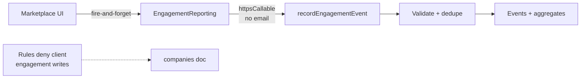

---
layout: with-outline-two-cols
---

# A1 · Solution

What we accept from the challenge

- Reuse the **ad-analytics trust model** via `httpsCallable`
- Payload: `{ companyId, eventType, placement }` — **no email**
- `eventType`: `website_view` \| `call_click` \| `booking_click`
- Single **EngagementReporting** client used by both call sites
- Fire-and-forget — UI never waits on analytics
- Events/aggregates written **only by CF**; stop PII arrays on company root
- Emulator rules: **deny** client writes to engagement fields
- Dart unit tests + emulator positive/negative auth tests + runbook

::right::

# Rejected

What we will not do — and why

**Rejected:** narrow rules only, client still `arrayUnion`s.

- **Why reject:** modified clients can still spam valid-shaped events
- **Why reject:** does not match proven ad callable pattern
- **Why reject:** still contends on company documents
- **Also rejected:** open `engagement_events` client creates — still forgeable
- **Chosen:** server-authoritative callable + deny client writes

---

# A1 · Plan

How I will deliver Phase 2 · 3–5 working days

- **Day 1 — Seam:** Extract `EngagementReporting`; wire both call sites; keep temporary Firestore write behind the interface; add interface tests.
- **Day 2 — Callable:** Switch impl to CF payload aligned with ad callables; fire-and-forget + failure handling. Smallest slice: one event type (`call_click`) on one site first.
- **Day 3 — Rules:** Emulator denies client engagement writes; positive/negative rules tests; CF stub or paired function as lead directs.
- **Day 4 — Data model:** Events + aggregates; retention note; dual-write off by default.
- **Day 5 — Runbook + demo:** README, success + network-failure demo, PR polish.

<strong>Demo promise:</strong> tap call → event without email; kill network → call/book still works; direct client update to `website_view` → DENIED.

---
layout: with-outline-section
---

# App C2

## Release confidence pipeline

Runtime controls exist (Sentry, App Check, Shorebird), but there is no repeatable gate that proves a commit is fit for TestFlight / Play internal.

---
layout: with-outline-two-cols
---

# A2 · Problem

Full problem

Flutter tests exist but are thin. This tree is missing checked-in GitHub Actions build/test/release, Fastlane, Codemagic config, Firebase Emulator Suite config, <code>integration_test/</code>, and Firestore rules in VCS. Sentry, App Check, and Shorebird run in-app — they are <strong>not</strong> a release gate. Success is a secure, reviewable pipeline for TestFlight and Play internal — not a production store launch.

::right::

Business impact

- Broken builds reach internal testers more easily
- Regressions hurt booking / marketplace trust early
- Manual “works on my machine” — slow, non-auditable
- Signing secrets risk if handled ad hoc
- Leadership has no evidence trail for raised baseline

---

# A2 · Evidence

What this checkout shows

| Capability | Status |
|------------|--------|
| Unit / widget tests | Present but thin |
| GHA build/test/release | Missing |
| Fastlane / Codemagic | Missing |
| Emulator + rules in VCS | Missing |
| `integration_test/` | Missing |
| Sentry / App Check / Shorebird | Present in-app |
| Version | `1.0.1+8` in `pubspec.yaml` |

---
layout: with-outline-center
---

# A2 · Architecture

Today vs proposed trust boundary

<strong>Row 1 — Today</strong>

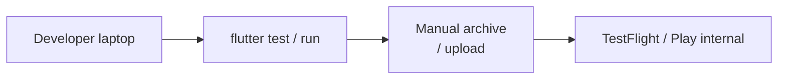

<strong>Row 2 — Proposed</strong>

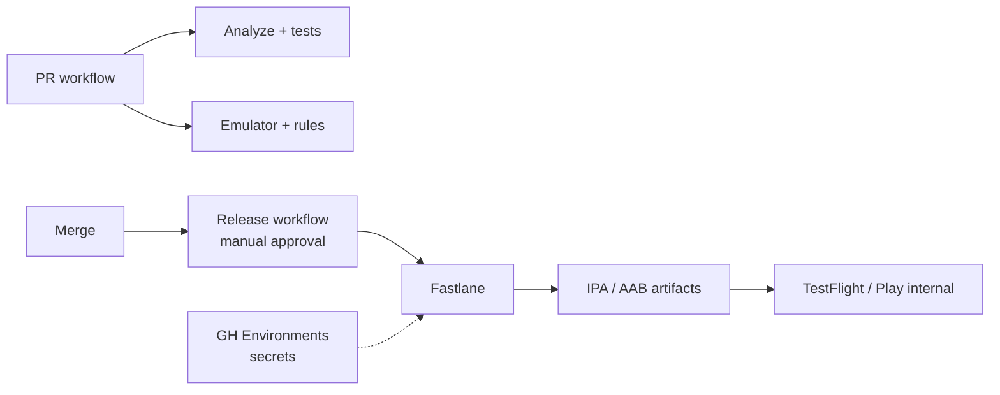

---
layout: with-outline-two-cols
---

# A2 · Solution

What we accept from the challenge

- **GitHub Actions + Fastlane** as default stack
- **PR workflow:** FVM Flutter 3.29.1 → format/analyze → expanded tests → ≥1 integration path → emulator + rules test
- **Release workflow:** `workflow_dispatch` + environment approval; lanes for Android internal + iOS TestFlight (or documented dry-run)
- **CI injects build numbers** — no `pubspec` churn on every PR
- Secrets only in protected environments — never logged / never committed
- Auditable artifacts + rollback / release-stop runbook

::right::

# Rejected

What we will not do — and why

**Rejected as primary:** Codemagic-only pipeline.

- **Why reject:** second vendor outside GitHub PR checks
- **Why reject:** credential/cost duplication vs Actions Environments
- **Also rejected:** PR-only CI with no approved release lane
- **Chosen:** Actions (PR) + Actions/Fastlane (approved release)
- Panel may Accept with Changes if Codemagic preferred

---

# A2 · Plan

How I will deliver Phase 2 · 3–5 working days

- **Day 1 — PR gate:** GHA with FVM, analyze, existing tests; README CI section. Smallest slice: red/green PR gate.
- **Day 2 — Tests:** Expand focused unit tests; add `integration_test/` skeleton + one path; document device constraints.
- **Day 3 — Emulator:** Check in Firebase emulator config + one Firestore rules test; wire into PR workflow.
- **Day 4 — Release lane:** CI build numbers; Fastlane + release workflow with environment approval; secrets documentation.
- **Day 5 — Dry-run + runbook:** Dry-run or real upload if credentials exist; rollback/stop procedure; demo script.

<strong>Demo promise:</strong> green PR run → release workflow needs approval → artifact / dry-run → show release-stop steps in runbook.

---
layout: with-outline-section
---

# App C3

## Scalable booking deep links

Booking deep-link resolution can fall back to a full <code>companies</code> collection scan — unbounded cost and wrong-company risk.

---
layout: with-outline-two-cols
---

# A3 · Problem

Full problem

<code>resolveBookingSlugOrId</code> tries websites lookup and company id forms, then falls back to <code>db.collection('companies').get()</code> — a full collection scan — and matches brand/legal/website fields in memory. Dual slug helpers disagree (hyphenated web-style vs no-hyphen share slug). Offline/cache behavior is unclear; fuzzy match can resolve the <strong>wrong company</strong>.

::right::

Business impact

- Slow or failed Book links from ads / SMS / web
- Firestore reads scale with entire companies collection
- Lost bookings on timeout or mis-resolve
- Confusing offline / stale cache behavior
- Support cannot explain intermittent failures

---

# A3 · Evidence

Resolver path today

- File: `lib/core/deep_link/booking_slug_resolver.dart`
- Order: `websites/{id}` → company doc id / suffix → **full `companies.get()`** → in-memory match
- Caller: `BookingDeepLinkPage` → `go('/booking?companyId=…')` or generic error
- `generateBookingUrlSlug` (hyphenated) vs `generateCompanySlug` (no hyphens)

---
layout: with-outline-center
---

# A3 · Architecture

Today vs proposed trust boundary

<strong>Row 1 — Today</strong>

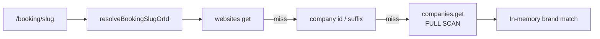

<strong>Row 2 — Proposed</strong>

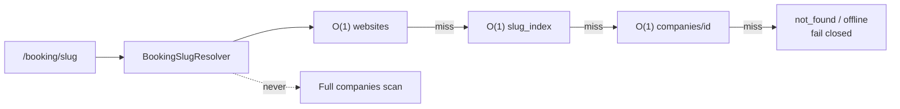

---
layout: with-outline-two-cols
---

# A3 · Solution

What we accept from the challenge

- Remove unbounded `companies.get()` from the customer path
- Canonical web-style slug + lookups: **websites → slug_index → company id**
- Bounded read budget (target **≤ 3** gets)
- **Fail closed** on miss / ambiguity — never silent wrong company
- Clear UX: not found / offline / retry
- Dart tests for normalization + each branch; emulator/seam tests
- Dry-run backfill plan for lead (fixtures/emulator only in Phase 2)

::right::

# Rejected

What we will not do — and why

**Rejected as primary:** Cloud Function resolver only.

- **Why reject:** still need an O(1) index; adds latency/cold starts
- **Why reject:** pure CF fails closed offline without companyId cache
- **Also rejected:** keep scan but add `limit` — still non-deterministic / costly
- **Chosen:** `slug_index` + websites + id; fail closed; no scan

---

# A3 · Plan

How I will deliver Phase 2 · 3–5 working days

- **Day 1 — Delete the scan:** Injectable resolver seam + fixtures; remove `companies.get()`; miss → not found for now; tests for id + websites paths.
- **Day 2 — Index:** Add `slug_index` reads + canonical normalization; unit tests for all branches.
- **Day 3 — UX:** Offline / not found / retry on `BookingDeepLinkPage`; widget tests.
- **Day 4 — Emulator + backfill plan:** Emulator test; idempotent dry-run backfill tool/plan; rollback docs.
- **Day 5 — Runbook + demo:** Measurement notes, PR polish, demo (success + offline + not found).

<strong>Demo promise:</strong> fixture slug → correct booking; airplane mode → recovery UI; unknown slug → not found (never a random company); grep shows no full companies scan in resolver.

