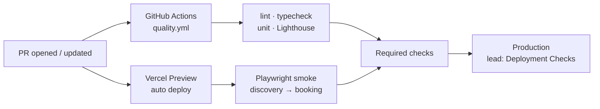
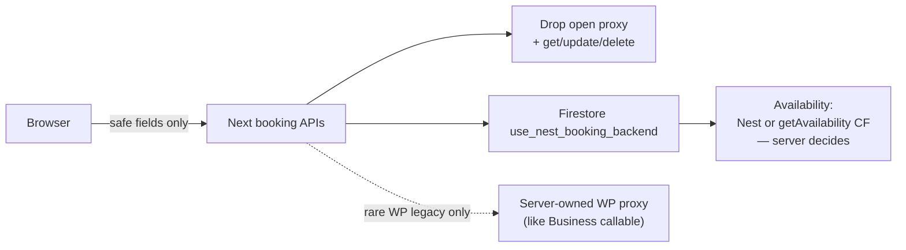
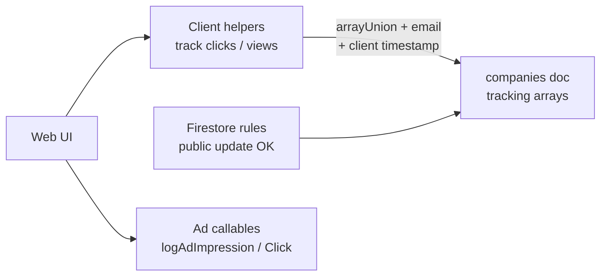
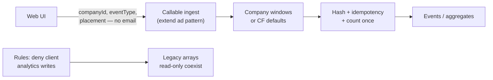
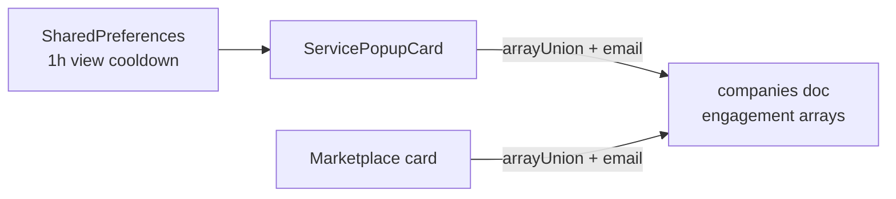
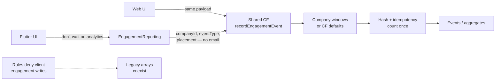
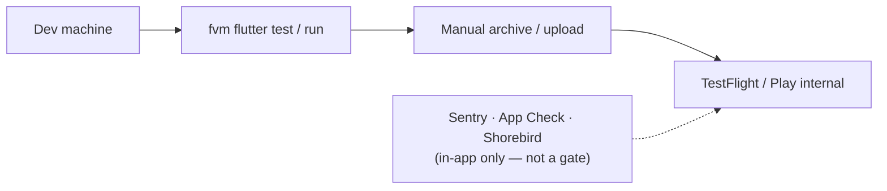
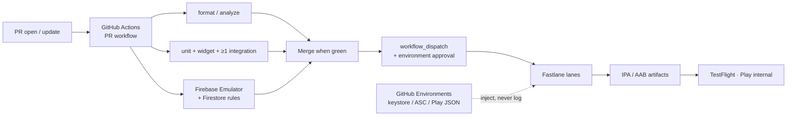
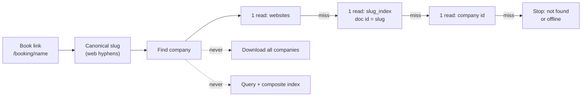

# Title

Aspio · SE1 → SE2 · Phase 1

# Marketplace Web + App

Phase 1 proposals for both surfaces — same rhythm, separate trust boundaries.

Proposal only · Implementation after written acceptance

---

# Agenda

Part A — Marketplace Web

| # | Challenge | Risk if we do nothing |
|---|-----------|------------------------|
| **W1** | **Ship without proof** — no CI quality gates before Vercel | Type errors and broken booking paths can reach customers |
| **W2** | **Trusted booking gateway** — APIs trust the browser too much | Arbitrary hosts, weak identity, hard-to-trust booking boundary |
| **W3** | **Authoritative analytics** — clients can forge metrics | Fake clicks/views, PII on company docs |

Part B — Marketplace App

| # | Challenge | Risk if we do nothing |
|---|-----------|------------------------|
| **A1** | **Trusted engagement events** — client writes analytics | Forgeable views/clicks + email on company docs |
| **A2** | **Release confidence pipeline** — no store release gate | Broken builds reach TestFlight / Play internal |
| **A3** | **Scalable booking deep links** — full companies scan | Cost, latency, wrong-company / offline confusion |

Rhythm each time: <strong>Problem → Evidence → Architecture → Solution → Plan</strong>

---
layout: with-outline-center
---

Context

# Marketplace surfaces

Aspio customer marketplace — Web first in this deck, then the Flutter App.

- **Web:** Next.js 16 / React 19 · Vercel · Firebase · Nest / Cloud Functions
- **App:** Flutter Marketplace · Firebase · Sentry / App Check / Shorebird
- Shared concerns: booking trust, engagement integrity, release confidence
- Evidence: web repo + Vercel; app challenges from the mobile proposal packs

---

# What Phase 1 is

The gate before we write production code

Phase 1 is the <strong>proposal</strong>. The panel must accept the scope in writing before Phase 2 implementation starts.

- I present the problem, architecture, tradeoffs, and a testable plan
- Panel outcome: **Accepted** / **Accepted with changes** / Not accepted
- If accepted with changes, <strong>those changes become the scope</strong>
- I implement in Phase 2 **only after** that written acceptance

**Ask at the end:** assign one challenge → accept this proposal as Phase 2 scope.

---
layout: with-outline-section
---

# Challenge 1

## Ship without proof

Marketplace can deploy to Vercel without proving lint, types, tests, booking smoke, or basic performance.

Brief name: <strong>Release confidence for Marketplace</strong>

---
layout: with-outline-two-cols
---

# C1 · Problem

Full problem

The repo only enforces <strong>branch policy</strong>. There is no required typecheck or test suite in CI. Next.js is set to <strong>ignore TypeScript build errors</strong>. Booking unit tests exist but nothing runs them. Vercel only runs <strong>next build</strong>, with <strong>no Deployment Checks</strong>.

Short version: we check the git path, not that the product still works.

::right::

Business impact

- Type or booking bugs can reach **Production customers**
- Discovery → booking funnel breaks hurt conversion
- Failures show up late — on Vercel or in prod, not in the PR
- Branch policy feels “safe” while quality is still ungated

---

# C1 · Evidence

What the repo and Vercel show

- No quality CI — only branch-policy workflows
- No typecheck / test scripts — `package.json` has build + lint only
- `ignoreBuildErrors: true` — TypeScript debt can still ship
- ~23 booking-related tests — no runner, no CI gate
- Vercel = `next build` only — Deployment Checks: **none**
- Preview URL exists — still **ungated** for quality signals

---
layout: with-outline-center
---

# C1 · Architecture

Proposed quality pipeline

- **Trigger:** every PR open/update
- **We add:** `quality.yml` + npm scripts (`typecheck`, `test`) — yml **runs** the unit tests (test files already exist / we wire a runner)
- **Vercel Preview:** already auto for PRs — we add Playwright **against that URL**
- **Gate → Prod:** lead turns on required checks / Deployment Checks (we document; don’t flip ourselves)

CI owns quality · Vercel hosts · browser untrusted · Firebase/Nest unchanged

---
layout: with-outline-two-cols
---

# C1 · Solution

What we accept from the challenge

This is the Phase 2 scope I am proposing

- Add a **GitHub Actions** quality workflow: lint, typecheck, unit tests
- Add **Playwright** smoke: public discovery → booking entry on Preview
- **Document** how checks gate merge and Production (lead applies settings)
- **Staged plan** to remove `ignoreBuildErrors` safely
- Add a **Lighthouse** budget on one public route
- Document **env boundaries**: local / Preview / Production — no secrets in `NEXT_PUBLIC_*`

::right::

# Rejected

What we will not do — and why

**Rejected alternative:** only turn off `ignoreBuildErrors` and hope Vercel build is enough.

- **Why reject:** ~255 TS errors today — flipping the flag alone can break Production builds
- **Why reject:** still no unit tests, Playwright, or Lighthouse gate
- **Why reject:** booking tests stay unrunnable — the brief’s main risk stays open
- **Chosen instead:** full quality pipeline + staged TypeScript cleanup

---

# C1 · Plan

How I will deliver Phase 2 · 3–5 working days

- Add npm scripts for typecheck + unit tests, and a GitHub Actions **`quality.yml`** that runs them on every PR (yml = robot recipe; tests live in files + scripts).
- Count today’s TypeScript errors. Keep the “ignore errors on build” flag for now. Write a short step-by-step plan to turn that flag off later without killing the live site overnight.
- Add a short browser test: find a business → reach booking start. Run it on the temporary Preview site (not Production). No Production secrets.
- Add a basic page-speed check on one public page. Write which settings a lead should turn on in GitHub/Vercel so bad PRs cannot merge or go live. We document; we don’t flip protected settings ourselves.
- Fix flaky checks, finish the short how-to (setup, verify, undo), open the PR, practice the panel walkthrough.

---
layout: with-outline-section
---

# Challenge 2

## Trusted booking gateway

Booking APIs currently trust the browser for destination, credentials, and identity — so authorization and failure behavior are hard to reason about.

Brief name: <strong>Trusted booking gateway</strong>

---
layout: with-outline-two-cols
---

# C2 · Problem

Full problem

<code>app/api/booking-proxy</code> accepts a caller-provided <strong>url</strong>, <strong>token</strong>, <strong>HTTP method</strong>, and <strong>body</strong>, then the server fetches that URL. Separate booking <strong>get</strong> and <strong>update</strong> routes forward <code>uid: undefined</code> to Cloud Functions. The availability route lets a caller set <code>useNestBackend</code> and forwards body fields to Nest. These boundaries make source-of-truth authorization, destination control, and failure behavior difficult to reason about.

Short version: the browser helps decide <strong>where</strong>, <strong>with which token</strong>, and <strong>as whom</strong>.

::right::

Business impact

- **Open proxy / SSRF-style risk** — our server can be told to call a URL we did not choose, with a token we did not own
- **Weak booking identity** — get/update send `uid: undefined`, so we cannot prove which customer did the action
- **Client-steered availability** — browser can force the Nest path instead of reading the company flag
- **Error leakage** — raw downstream failures can surface to the customer
- **Untrusted booking boundary** — support and security cannot rely on these doors

---

# C2 · Evidence

What the Marketplace web routes show

| Route | Issue | UI today |
|-------|--------|----------|
| `/api/booking-proxy` | Caller supplies `url` + `token` + method + body → server `fetch` | **No page** uses helpers — route still live |
| `/api/bookings/get` | Forwards `uid: undefined` to `getBookingById` | Booking **detail** load fallback (Firestore → WordPress) |
| `/api/bookings/update` | Forwards `uid: undefined` to `editBookingById` | Save hidden in `view=true`; route still callable |
| `/api/bookings/delete` | Same `uid: undefined` pattern | **No UI** — cancel is the product path |
| `/api/get-availability` | Client can set `useNestBackend` | Booking flow `/booking/[companyId]` |

---
layout: with-outline-center
---

# C2 · Architecture

Proposed trust boundary (server-owned)

Detail = Firebase first · drop getBookingById / update · open booking-proxy gone · rare WP via server-injected token — never client url+token · Nest vs getAvailability = server reads company flag

---
layout: with-outline-two-cols
---

# C2 · Solution

What we accept from the challenge

Phase 2 — close weak booking doors; availability Nest flag on server only

- **Disable/remove** open `/api/booking-proxy` + dead helpers (client url + token)
- **Disable/remove** `/api/bookings/get`, `/update`, `/delete` — no customer update UI; detail uses **Firestore**; cancel stays
- **Rare WordPress legacy:** if a booking is missing in Firebase, use a **server-owned** WP path (Business-style `wordpressProxy` / callable injects token) — **not** the open booking-proxy
- **Availability:** drop client `useNestBackend`; server reads Firebase **`use_nest_booking_backend` only** + schema / rate controls

::right::

# Rejected

What we will not do — and why

**Rejected:** keep open `booking-proxy` (or “add login” but still accept client `url` + `token`) for get.

- **Why reject:** authenticated open proxy is still an open proxy
- **Why reject:** Marketplace get/update with `uid: undefined` stay weak if we keep them
- **Chosen:** drop get/update/delete + open proxy; Firebase detail; rare WP via **server-owned** proxy only; Nest flag server-only

---

# C2 · Plan

How I will deliver Phase 2 · 1 working day

- **Disable/remove** open `/api/booking-proxy`, `/api/bookings/get`, `/update`, `/delete` (+ dead helpers)
- Detail load = Firestore only; optional rare WP fetch via **server-owned** proxy (token not from client)
- **Availability:** drop client `useNestBackend`; read `use_nest_booking_backend` from Firestore; basic schema / rate controls
- **Tests + runbook:** closed routes 410/404; Nest flag ignored from client; verify + rollback in the PR

---
layout: with-outline-section
---

# Challenge 3

## Authoritative analytics

Anyone can write marketplace analytics into company documents — so clicks and views are not trustworthy metrics.

Brief name: <strong>Authoritative marketplace analytics</strong>

---
layout: with-outline-two-cols
---

# C3 · Problem

Full problem

Firestore rules permit anyone to update company <code>call_clicks</code>, <code>booking_clicks</code>, <code>website_view</code>, and <code>ad_analytics</code>. Client helpers append <strong>email</strong>, <strong>client timestamps</strong>, and <strong>source</strong> values directly to company-document arrays. A browser can forge or replay this data, PII is retained in operational documents, and document growth has no visible retention boundary. The repository already uses callable functions for ad events, so there is a real alternative pattern to evaluate.

Short version: we treat analytics as if the browser were honest — it is not.

::right::

Business impact

- **Forged clicks / views** — anyone can fake or replay marketplace engagement
- **PII on company docs** — email sits on operational arrays (privacy / retention risk, not a legal verdict)
- **Unbounded arrays** — docs grow → cost and slower company reads
- **Untrusted metrics** — bad calls on marketing, ranking, “what works”
- **Split patterns** — ads already use callables; views/clicks still trust the client

---

# C3 · Evidence

What the repo and rules show

| Area | Evidence |
|------|----------|
| Firestore rules | Public `update` if only tracking keys change (`call_clicks`, `booking_clicks`, `website_view`, `ad_analytics`) |
| Client helpers | `trackCallClick` / `trackBookingClick` → `arrayUnion` `{ email, date, source }` |
| Website views | Client `trackWebsiteView` writes `website_view` arrays |
| Better pattern | Ads → callables `logAdImpression` / `logAdClick` with `{ adId, companyId, placement }` — no email |

**Pattern to extend:** ad callables already do trusted server writes. Views + one conversion should follow that — not client `arrayUnion`.

---
layout: with-outline-center
---

# C3 · Architecture

Today vs proposed trust boundary

<strong>Row 1 — Today (client-authoritative)</strong>

<strong>Row 2 — Proposed (server-authoritative)</strong>

Per-company windows on Firebase (admin-editable). Null → CF defaults: website ~1h · call ~10m · book ~15m. Hash event fields + idempotency key → same click once. No email · optional server uid if panel asks.

---
layout: with-outline-two-cols
---

# C3 · Solution

What we accept from the challenge

Phase 2 scope — ad-style callable + lock client writes

- Extend the **ad callable pattern** for **website_view** + **one conversion** (booking or call click)
- Client sends `{ companyId, eventType, placement }` (+ optional `clientEventId`) — **no email**
- CF **validates** and writes **events / counts** (server timestamp)
- **Dedupe windows on the company doc** (admin can change per company): `website_view` / `call_click` / `booking_click` minutes
- **If null → CF defaults:** website **~1h** · call **~10m** · book **~15m** (shared with App)
- **Hash + idempotency:** mash event fields into one fingerprint; same key / same window → count once
- **Tighten rules** — clients cannot `arrayUnion` those tracking fields
- **Legacy arrays stay** — coexistence only; no production analytics wipe
- **Optional (Accepted with Changes):** if logged in, server may attach **`uid` from token** — never client email/name

::right::

# Rejected

What we will not do — and why

**Rejected:** require auth in Firestore rules, but keep client `arrayUnion` into company arrays.

- **Why reject:** a signed-in user can still forge and replay volume
- **Why reject:** email/PII and unbounded arrays remain
- **Chosen:** callable ingest (like ads) + deny client tracking writes + leave legacy arrays read-only

---

# C3 · Plan

How I will deliver Phase 2 · 1 working day

- **Callable + client switch:** website_view + one conversion via ad-style CF; stop client `arrayUnion` for those fields
- **Company windows + defaults:** read per-company minutes; if null use CF defaults (website ~1h · call ~10m · book ~15m)
- **Hash + idempotency in CF:** fingerprint event fields; reject same key / same-window replay
- **Rules:** deny client writes to selected tracking fields; keep public catalogue reads
- **Coexistence + tests + runbook:** no prod array wipe; client write denied; verify + rollback in the PR

---
layout: with-outline-section
---

# Marketplace App

## Phase 1 challenges

Flutter Marketplace — engagement trust, release confidence, and scalable booking deep links.

Same Phase 1 gate: proposal only until Accepted / Accepted with Changes.

---
layout: with-outline-section
---

# App C1

## Trusted engagement events

Organic marketplace engagement is written from the Flutter client into company documents — unlike ad analytics, which already use trusted callables.

---
layout: with-outline-two-cols
---

# A1 · Problem

Full problem

Same engagement as Marketplace <strong>Web</strong>: the Flutter client writes <code>website_view</code>, <code>call_clicks</code>, and <code>booking_clicks</code> onto company docs via <code>FieldValue.arrayUnion</code>. Payload includes <strong>email</strong>, client <strong>date</strong>, and <strong>source</strong>. Website-view cooldown is client-only <code>SharedPreferences</code> (bypassable). Call/booking clicks have no server dedupe. Ads already use callables with <strong>no email</strong>.

::right::

Business impact

- **Forged clicks / views** — same trust hole as web
- **PII on company docs** — email on operational arrays
- **Unbounded arrays** — cost and larger company reads
- **Untrusted metrics** — ranking / abuse review unreliable
- **Split patterns** — ads use callables; organic engagement still trusts the device

---

# A1 · Evidence

Verified call sites + same shape as web

| Event | Field | Mechanism |
|-------|--------|-----------|
| Website view | `website_view` | `arrayUnion` |
| Call click | `call_clicks` | `arrayUnion` |
| Booking click | `booking_clicks` | `arrayUnion` |

- `service_popup_card.dart` — `_trackWebsiteView` / `_trackCallClick` / `_trackBookingClick`
- `marketplace_page.dart` — same three on `_CompanyCardState`
- Payload today: `{ email, date, source: 'Mobile Marketplace' }` — **same idea as web**
- Ads contrast: `httpsCallable` · `{ adId, companyId, placement }` · no email

---
layout: with-outline-center
---

# A1 · Architecture

Today vs proposed — shared CF with Web C3

<strong>Row 1 — Today (device writes company arrays)</strong>

Cooldown = phone-only “don’t count another website view for 1 hour” — easy to bypass; not a server rule.

<strong>Row 2 — Proposed (same callable as Web)</strong>

Same as Web: per-company windows (admin) · null → website ~1h · call ~10m · book ~15m · hash + idempotency · don’t wait on analytics · optional server uid if panel asks

---
layout: with-outline-two-cols
---

# A1 · Solution

What we accept from the challenge

Flutter client → <strong>same CF as Web C3</strong> — not a second function

- Call shared **`recordEngagementEvent`** (or extend ads-family) — same contract as web
- Payload: `{ companyId, eventType, placement }` — **no email**
- `eventType`: `website_view` \| `call_click` \| `booking_click`
- Single **EngagementReporting** used by both Flutter call sites; don’t wait on analytics
- CF writes **events / counts**; stop client `arrayUnion` + PII
- **Dedupe windows on the company doc** (admin can change) — same fields as Web C3
- **If null → CF defaults:** website **~1h** · call **~10m** · book **~15m** (replaces weak phone-only cooldown)
- **Hash + idempotency:** fingerprint event fields; same key / same window → once
- **Rules deny** client engagement writes; legacy arrays coexist
- **Optional (Accepted with Changes):** server-derived **`uid`** when logged in

::right::

# Rejected

What we will not do — and why

**Rejected:** narrow rules only, client still `arrayUnion`s.

- **Why reject:** signed-in / modified clients can still spam valid-shaped events
- **Why reject:** does not match proven ad callable pattern
- **Why reject:** a mobile-only CF when web needs the same door
- **Chosen:** shared server-authoritative callable + deny client writes

---

# A1 · Plan

How I will deliver Phase 2 · aligned with Web C3

- Extract **EngagementReporting**; wire both Flutter call sites (popup + card)
- Point the client at the **shared CF** (same payload + company windows / defaults + hash as web); don’t wait on analytics; no email
- Emulator rules: deny client engagement writes; legacy arrays read-only coexist
- Dart unit tests + rules positive/negative; runbook + PR (pair with web CF if lead splits repos)

---
layout: with-outline-section
---

# App C2

## Release confidence pipeline

Runtime controls exist (Sentry, App Check, Shorebird), but there is no repeatable gate that proves a commit is fit for TestFlight / Play internal.

---
layout: with-outline-two-cols
---

# A2 · Problem

Full problem

Flutter tests exist but are thin. This tree is missing checked-in GitHub Actions build/test/release, Fastlane, Codemagic config, Firebase Emulator Suite config, <code>integration_test/</code>, and Firestore rules in VCS. Sentry, App Check, and Shorebird run in-app — they are <strong>not</strong> a release gate. Success is a secure, reviewable pipeline for TestFlight and Play internal — not a production store launch.

::right::

Business impact

- Broken builds reach internal testers more easily
- Regressions hurt booking / marketplace trust early
- Manual “works on my machine” — slow, non-auditable
- Signing secrets risk if handled ad hoc
- Leadership has no evidence trail for raised baseline

---

# A2 · Evidence

What this checkout shows

| Capability | Status |
|------------|--------|
| Unit / widget tests | Present but thin |
| GHA build/test/release | Missing |
| Fastlane / Codemagic | Missing |
| Emulator + rules in VCS | Missing |
| `integration_test/` | Missing |
| Sentry / App Check / Shorebird | Present in-app |

---
layout: with-outline-center
---

# A2 · Architecture

Today vs proposed — trust boundaries

<strong>Row 1 — Today (no enforced gate)</strong>

<strong>Row 2 — Proposed (PR CI + approved release)</strong>

PR CI = untrusted branch, no store secrets. Release = protected environment + Fastlane. Same split as Web C1: prove on every PR, distribute only after approval.

---
layout: with-outline-two-cols
---

# A2 · Solution

What we accept from the challenge

- **GitHub Actions + Fastlane** as default stack
- **PR workflow:** FVM Flutter 3.29.1 → format/analyze → expanded tests → ≥1 integration path → emulator + rules test
- **Release workflow:** `workflow_dispatch` + environment approval; lanes for Android internal + iOS TestFlight (or documented dry-run)
- **CI injects build numbers** — no `pubspec` churn on every PR
- Secrets only in protected environments — never logged / never committed
- Auditable artifacts + rollback / release-stop runbook

::right::

# Rejected

What we will not do — and why

**Rejected as primary:** Codemagic-only pipeline.

- **Why reject:** second vendor outside GitHub PR checks
- **Why reject:** credential/cost duplication vs Actions Environments
- **Also rejected:** PR-only CI with no approved release lane
- **Chosen:** Actions (PR) + Actions/Fastlane (approved release)
- Panel may Accept with Changes if Codemagic preferred

---

# A2 · Plan

How I will deliver Phase 2

- Make every PR go red/green automatically (code checks + existing tests)
- Add more small tests + one “run the app” path; note what device/CI can run
- Check in fake Firebase + one security-rules test; run it on PRs
- Add an approved release job that builds iOS/Android files; document locked secrets (no keys in the repo)
- Practice a dry-run upload + how to stop a bad tester build; polish the PR for the panel

---
layout: with-outline-section
---

# App C3

## Scalable booking deep links

Booking deep-link resolution can fall back to a full <code>companies</code> collection scan — unbounded cost and wrong-company risk.

---
layout: with-outline-two-cols
---

# A3 · Problem

Full problem

<code>resolveBookingSlugOrId</code> tries websites lookup and company id forms, then falls back to <code>db.collection('companies').get()</code> — a full collection scan — and matches brand/legal/website fields in memory. Dual slug helpers disagree (hyphenated web-style vs no-hyphen share slug). Offline/cache behavior is unclear; fuzzy match can resolve the <strong>wrong company</strong>.

::right::

Business impact

- Slow or failed Book links from ads / SMS / web
- Firestore reads scale with entire companies collection
- Lost bookings on timeout or mis-resolve
- Confusing offline / stale cache behavior
- Support cannot explain intermittent failures

---

# A3 · Evidence

Resolver path today

- File: `lib/core/deep_link/booking_slug_resolver.dart`
- Order: `websites/{id}` → company doc id / suffix → **full `companies.get()`** → in-memory match
- Caller: `BookingDeepLinkPage` → `go('/booking?companyId=…')` or generic error
- `generateBookingUrlSlug` (hyphenated) vs `generateCompanySlug` (no hyphens)

---
layout: with-outline-center
---

# A3 · Architecture

Proposed — look up one company, never download all

<strong>Canonical <code>slug_index/{slug}</code></strong> = one doc per slug (direct get). Not a composite-index query over companies. ≤3 reads. Unsure → stop.

<strong>Must fix:</strong> full <code>companies.get()</code> scan · dual slug helpers (hyphen vs no-hyphen) · fuzzy wrong-company match · unclear offline UX · missing <code>slug_index</code> + backfill

---
layout: with-outline-two-cols
---

# A3 · Solution

What we accept from the challenge

- **Remove** the “download all companies” fallback from the Book-link path
- **One canonical slug** (web hyphens) for booking deep links — retire no-hyphen helper on this path
- Lookups: **website → `slug_index/{canonicalSlug}` → company id** (≤ **3** gets)
- **`slug_index` = doc-id map**, not a composite-index company query
- If unsure → **stop** (not found / offline) — never open a random company
- Clear screens: not found / offline / retry
- **Also fix:** backfill plan for `slug_index`; privileged writes only; share-URL dual-slug debt documented if out of slice

::right::

# Rejected

What we will not do — and why

**Rejected:** Cloud Function for every Book link · “scan with a limit” · resolve via **composite-index query** on companies

- **Why not CF-only:** still need a fast index; adds latency / cold starts; worse offline
- **Why not limited scan:** still slow, still can pick the wrong shop
- **Why not composite query:** multi-field indexes help filtered lists — deep links need slug→company once; doc-id `slug_index` is cheaper and unambiguous
- **Chosen:** canonical `slug_index` + website + id · fail closed · no full scan

---

# A3 · Plan

How I will deliver Phase 2 · step by step

1. **Keep working paths:** Book Now from the **popup** (and notifications) already open `/booking?companyId=…` — they **skip** slug resolve; leave that alone.
2. **Same logic when id is missing:** public `/booking/{slugOrId}` (ads / SMS / shared links) has no `companyId` → run the new resolver (same logic everywhere we lack an id).
3. **Remove the scan:** delete full `companies.get()` fallback; temporary miss → not found; keep `websites/{id}` + `companies/{id}` gets.
4. **Canonical slug + `slug_index`:** one hyphenated web-style slug; `get slug_index/{slug}` → `companyId` (doc-id map, not composite query).
5. **Fail closed UX:** Book-link screen shows not found / offline / retry — never a wrong company.
6. **Tests + backfill plan:** unit/emulator branches; dry-run `slug_index` backfill for lead; document share-URL dual-slug follow-up if out of slice.

---
